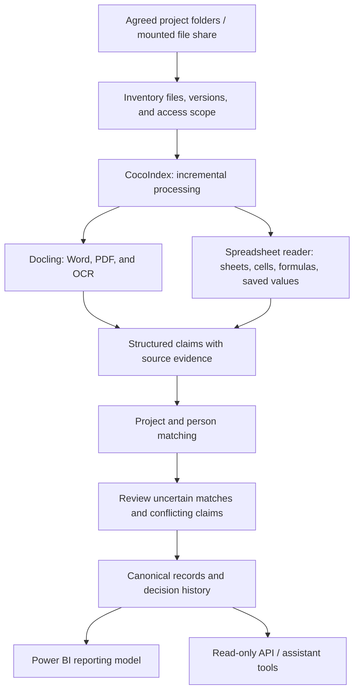

# Rysmaan: research and pipeline proposal

Last updated: 2026-09-28
Status: Research and proposed architecture; no pipeline implementation or benchmark completed.

This is the working record of our research, proposed approach, and unresolved questions before building. Capabilities below come from project documentation reviewed on the research date. Recommendations are our assessments, not measured comparisons. Verify versions and edition boundaries before adoption.

## 1. Product direction

The confirmed direction is an engineering knowledge pipeline:

**Company files / SharePoint → connected project records → Power BI and AI assistants.**

The first source to investigate is an engineering company's file system, containing Word, PDF, Excel, and related project documents. SharePoint remains part of the broader direction; its connector is a later evaluation.

The pipeline should connect information across proposals, project sheets, reports, CVs, and project registers. It should preserve evidence and bring disagreements to a person for review.

Example: `2021-044`, `St. Mary's Hospital Expansion`, and `SMH Phase II` may refer to the same project. A proposal and closeout report may disagree about dates. We need to distinguish project identity, document revisions, and conflicting claims before publishing a shared record.

This document covers the engineering knowledge direction represented by `/v3`. The construction procurement, vendor, and contract platform is outside this proposal.

### Intended outcomes

- Find projects by sector, client, location, dates, and participating people.
- Find relevant experience for proposals and staffing questions.
- Trace published information back to its source document and location.
- Review uncertain matches and conflicting values.
- Produce structured records for reporting and evidence-backed AI answers.
- Support customer ownership and export of the resulting database and reporting model.

## 2. Open-source research

Licenses describe the reviewed core repositories or stated community editions. They do not imply that all hosted or enterprise features are included.

| Project | Documented capabilities relevant to us | Proposed role / limitation |
| --- | --- | --- |
| [Docling](https://github.com/docling-project/docling) — MIT | Converts PDF, DOCX, XLSX, and other formats into a common document representation; supports PDF layout, tables, and OCR. | First parser to evaluate. Reading a document does not establish correct project identity or factual accuracy. |
| [Docling Graph](https://github.com/docling-project/docling-graph) — MIT | Schema-based extraction into entities and relationships; source provenance; graph merging with conflict records and human alias decisions. | Closest match for connected project records. Evaluate after parser quality; still requires our domain schema and review interface. |
| [CocoIndex](https://github.com/cocoindex-io/cocoindex) — Apache-2.0 | Incremental processing when source data or transformation logic changes; local-file and knowledge-graph examples. | Candidate pipeline engine. We must implement and verify file-server integration, scheduling, lifecycle behavior, and permissions. |
| [Onyx](https://github.com/onyx-dot-app/onyx) — MIT community edition | Organizational search, AI access, self-hosting, MCP server, and a SharePoint connector. | Finished-product reference for connectors and search. Check community/enterprise boundaries for required access-control features. |
| [RAGFlow](https://github.com/infiniflow/ragflow) — Apache-2.0 | Document ingestion, inspectable chunks, citations, and retrieval workflows. | Reference or alternative for document search and answers. Our canonical engineering records and reporting model remain separate work. |
| [Splink](https://github.com/moj-analytical-services/splink) — MIT | Probabilistic linkage and deduplication of structured records without common identifiers. | Optional matching component after extraction. Needs several informative fields; project names alone are insufficient. |
| [Graphiti](https://github.com/getzep/graphiti) — Apache-2.0 | Temporal entities and relationships, provenance, and changing facts. | Optional reference for history. Automatic fact invalidation must not substitute for review of contradictory source claims. |
| [Cognee](https://github.com/topoteretes/cognee) — Apache-2.0 core | Documents and other sources become a searchable knowledge graph for agents. | Alternative AI knowledge foundation. Engineering records, review, and BI outputs would still require custom work. |

### Current recommendation

Evaluate **Docling + CocoIndex** first, with dedicated spreadsheet extraction where needed. Then evaluate **Docling Graph** for entity extraction and reconciliation. Use **Onyx** as a product reference.

These are complementary components, not a verified turnkey stack. We have not found or tested a single project covering the complete engineering-specific workflow, human approval, and Power BI model.

## 3. File-format handling

| Input | Proposed approach | Pilot checks |
| --- | --- | --- |
| Word `.docx` | Docling document conversion. | Headings, tables, headers/footers, tracked changes, and stable section references. |
| Digital PDF | Docling layout and table extraction. | Reading order, multi-column pages, table headers, units, and page references. |
| Scanned PDF / images | Docling with an appropriate OCR configuration. | Scan quality, rotation, stamps, small text, and OCR errors in names and numbers. |
| Excel `.xlsx` | Evaluate Docling for general content; use a dedicated spreadsheet reader for precise workbook data. | Sheet/cell references, merged cells, multiple tables, hidden content, formulas, units, and saved results. |
| Legacy `.doc` / `.xls` | Current Docling documentation lists conversion through LibreOffice. | Deployment dependency, conversion fidelity, and preservation of the original source reference. |
| Other formats | Inventory before expanding the parser scope. | Actual frequency and business value. CAD/BIM and drawing interpretation need separate evaluation. |

[Docling's supported formats](https://docling-project.github.io/docling/usage/supported_formats/) and [processing options](https://docling-project.github.io/docling/reference/pipeline_options/) establish format support, not accuracy on our documents.

### Excel needs explicit treatment

For project registers, estimates, or calculation workbooks, retain workbook version, sheet name, cell/range, raw value, formula where present, stored calculated result, and relevant units or formatting.

With [openpyxl](https://openpyxl.readthedocs.io/en/stable/tutorial.html), formula text and the last saved calculated value are distinct reads. A stored result may be missing or stale. Reading it does not prove that it reflects the current formula or external dependencies.

Proposed policy: preserve both when available, flag uncertain results, and do not automatically recalculate or execute workbook macros. The pilot evaluates information extraction; it does not validate engineering calculations.

## 4. Proposed pipeline

All stages are proposed. Docling Graph is a candidate for the extraction and matching stages; a graph database is not yet a requirement.

### Stage 1: inventory and source access

- Run inside an environment with read access to agreed local folders or a mounted company share.
- Inventory file types, sizes, paths, modification times, and available access metadata.
- Record content hashes to identify versions and avoid unnecessary reprocessing.
- Preserve project folder structure as useful context, but do not assume folder names are authoritative.
- Record excluded, unreadable, locked, encrypted, or unsupported files with reasons.
- Define how source permissions constrain derived records and answers. A crawler's ability to read a file does not grant every user access to its contents.

### Stage 2: parse and preserve evidence

- Route files to the appropriate parser and retain structured output.
- Preserve tables and document structure alongside searchable text.
- Record parser version, configuration, processing time, warnings, and failures.
- Use format-appropriate source locations: PDF pages/bounding boxes, Word sections or document elements, Excel sheets/cells.
- Keep file version information with citations so changed files cannot silently replace the evidence for an older claim.

### Stage 3: extract domain claims

Proposed initial fields: project number, project name and aliases, client, location, sector, dates, people, and roles.

Each extracted claim should retain its raw value, normalized value, source location, and extraction run. Schema validation checks structure; it does not prove the claim is correct. Missing information should remain missing.

Evaluate Docling Graph's [provenance support](https://github.com/docling-project/docling-graph/blob/main/docs/fundamentals/graph-management/provenance.md). Verify whether evidence is precise enough for each field; node-level provenance alone may not establish the source of every attribute.

### Stage 4: match identities and reconcile claims

- Begin with normalized identifiers and explicit aliases within a firm's namespace.
- Check project phase, location, client, and other fields before merging similarly named projects.
- Use fuzzy or probabilistic matching for candidate suggestions when deterministic rules are insufficient.
- Keep identity decisions separate from decisions about which field value to publish.
- Distinguish document revisions, actual changes over time, and unresolved contradictions.
- Preserve original claims and record who accepted or rejected a match or value, when, and why.

Docling Graph's [merge workflow](https://docling-project.github.io/docling-graph/usage/cli/merge-command/) is a useful starting point: it records conflicts and supports human confirmation of ambiguous aliases through a decisions file. We would need an appropriate review interface.

### Stage 5: store and publish

Proposed starting point: a relational database containing canonical projects, people, organizations, participation relationships, source claims, and review decisions. Evaluate graph storage only if demonstrated query needs justify it.

- Power BI should consume stable reporting tables/views with explicit rules for unresolved or unreviewed information.
- Assistant tools should retrieve permitted records and supporting evidence, with unresolved disagreements visible.
- Database and reporting-model export should be designed around the customer ownership promise.

Power BI connectivity, hosting, authentication, and Claude/Copilot integration have not been validated. They are separate implementation decisions.

### Stage 6: maintain the records

- Reprocess affected files when content or extraction logic changes.
- Reconcile updates with existing review decisions without silently overriding them.
- Define behavior for renamed, moved, deleted, and newly restricted files.
- Preserve authorized audit history while preventing deleted or inaccessible evidence from remaining available in answers contrary to the agreed policy.
- Make failed processing retryable and visible.

Use the [CocoIndex local-file quickstart](https://github.com/cocoindex-io/cocoindex-quickstart) as an initial reference. Network-share behavior and the full update lifecycle still need testing.

## 5. Minimum data model to investigate

| Record | Purpose |
| --- | --- |
| Source document | Original path, customer/source scope, document type, and access metadata. |
| Document version | Content hash, observed timestamps, revision/issue metadata, and retained evidence reference. |
| Extraction run | Parser/model/configuration versions, status, timing, and errors. |
| Claim | Entity candidate, field, raw/normalized value, and source location. |
| Canonical entity | Stable project, person, or organization identity with aliases. |
| Relationship | Person's role on a project, project client, and supporting claims. |
| Review decision | Match or value decision, reviewer, time, rationale, and affected claims. |

This is a conceptual model, not an approved database schema.

## 6. Pilot before implementation commitments

Proposed corpus: **50–100 representative files** across several projects, including documents that refer to the same projects under different names.

Include Word proposals and CVs, digital and scanned PDFs, Excel registers and formula workbooks, revisions, duplicates, ambiguous project names, and known conflicting facts. Include legacy formats if they are materially present in the real archive.

Create a manually reviewed reference set of expected fields, identities, conflicts, and source locations. Keep a subset aside to check whether tuning generalizes.

| Evaluation | What to record |
| --- | --- |
| Parsing | Success/failure by format; missing text, tables, and sheets. |
| Extraction | Correct, incorrect, and missed values by field; accuracy of source references. |
| Matching | Correct links, false merges, and missed links; project-phase confusion. |
| Conflict handling | Known conflicts surfaced; false conflict alerts; preservation of both claims. |
| Review effort | Time to resolve candidates and conflicts; decisions retained after reprocessing. |
| Incremental updates | Behavior on unchanged, edited, renamed, moved, and deleted files; recovery after failure. |
| Permissions | Restricted evidence and derived facts excluded from unauthorized queries. |
| Operations | Processing time, memory, model costs, and storage use. |
| Outputs | Reproducible project counts and sample answers with evidence. |

Agree numerical acceptance thresholds after reviewing the corpus and consequences of errors. False project merges and unsupported published facts deserve particular attention. Format support or a successful demo is not sufficient evidence for adopting a component.

## 7. Decision log

| Date | Decision / position | Status |
| --- | --- | --- |
| 2026-09-28 | Focus on the engineering knowledge pipeline rather than the procurement platform. | Confirmed by user. |
| 2026-09-28 | Prioritize company file systems containing Word, PDF, and Excel. | Confirmed initial use case; deployment details open. |
| 2026-09-28 | Maintain research and a pipeline proposal before building. | Confirmed by user. |
| 2026-09-28 | Evaluate Docling + CocoIndex first. | Recommendation; not benchmarked or adopted. |
| 2026-09-28 | Supplement parsing with precise spreadsheet extraction where needed. | Proposal. |
| 2026-09-28 | Evaluate Docling Graph after parsing quality is established. | Proposal. |
| 2026-09-28 | Start with a relational canonical store; justify graph storage through actual needs. | Proposal. |

## 8. Open questions

- Where do files live: Windows server/SMB, NAS, local drives, or multiple sources?
- How many files, projects, and years of history exist, and how often do they change?
- How consistent are project numbers, folder structures, and revision conventions?
- What proportion is scanned, legacy Office, password-protected, or drawing-heavy?
- Which Excel workbooks are registers versus engineering calculations or estimates?
- Which fields and business questions are essential for the first useful release?
- Who reviews uncertain matches and conflicting facts?
- Which access boundaries exist between teams, projects, and clients?
- Must all processing remain on premises, or are approved external models allowed?
- What evidence retention and deletion rules should apply?
- Is the first output Power BI, an assistant integration, or a reviewable project register?
- What handover format and hosting arrangement satisfy customer ownership?

## 9. Next actions

- [ ] Agree pilot scope and obtain a representative, authorized sample corpus.
- [ ] Inventory formats and establish the manually reviewed reference set.
- [ ] Pin candidate versions and confirm required features in their open-source editions.
- [ ] Compare parsing results, with particular attention to tables and Excel.
- [ ] Test extraction, matching, provenance, and the review workflow.
- [ ] Test incremental updates and permission behavior on the intended file system.
- [ ] Record results here and decide which components to adopt.
- [ ] Finalize storage and output integrations before building the production pipeline.

## 10. Research maintenance

For each new finding, record the date, source URL, applicable version/edition, observed capability or limitation, and implication for our proposal. Keep documentation claims separate from results measured on our corpus. Update the decision log when a recommendation is adopted, rejected, or replaced.
